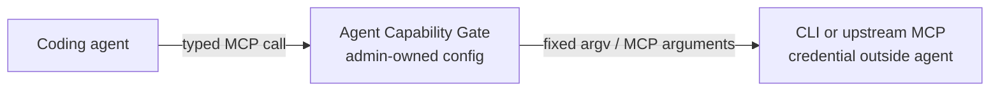

# Agent Capability Gate

You can tell a coding agent “use only this namespace” or “work only in this project.” But a broad CLI or MCP tool still lets it choose every namespace, project, and option. Direct CLI access may also require giving the agent a credential it can read and reuse. Prompts and command rules do not turn either problem into a mechanical boundary.

Agent Capability Gate turns one reviewed operation into the only interface an agent receives.

- Expose a narrow slice of an existing CLI or MCP server as a typed MCP tool.
- Fix the operation, scope, arguments, environment, and credential authority under administrator control.
- Accept only a closed input schema and resolve it to exact CLI or MCP arguments—never a shell command string.

Read the [user guide](docs/usage.md) for the threat model, deployment boundary, configuration model, and constraints.


```mermaid
flowchart LR
    A["Coding agent"] -->|"typed MCP call"| B["Agent Capability Gate<br/>admin-owned config"]
    B -->|"fixed argv / MCP arguments"| T["CLI or upstream MCP<br/>credential outside agent"]
```

## Install

Rust 1.98.1 is pinned for this repository. From the repository root:

```sh
cargo install --locked --path crates/boundary --bin mcp-boundary
```

Cargo downloads missing dependencies from the configured registry.

This installs `mcp-boundary` to `~/.cargo/bin` by default (or `$CARGO_HOME/bin` when `CARGO_HOME` is set). Remove it with:

```sh
cargo uninstall mcp-boundary
```

## CLI example

Turn `git` into one capability: read a bounded number of recent commits from one fixed repository. Create `/absolute/path/git-history.yaml` and adjust the administrator-owned repository path:

```yaml
version: 1

server:
  name: git-history
  transport: { kind: stdio }

targets:
  git:
    kind: cli
    executable: /usr/bin/git
    cwd: /srv/example-app # The agent cannot select another repository.
    limits:
      timeout_ms: 5000
      stdout_bytes: 65536
      stderr_bytes: 4096

tools:
  recent_commits:
    description: Read recent commits from the configured repository
    input_schema:
      type: object
      additionalProperties: false # Undeclared inputs are rejected.
      properties:
        limit:
          type: integer
          minimum: 1
          maximum: 20 # The only caller-controlled value is bounded.
      required: [limit]
    invoke:
      target: git
      cli:
        argv:
          - literal: log # The operation and argv shape are fixed.
          - literal: --oneline
          - literal: --no-decorate
          - literal: --max-count
          - input: /limit
    output: { kind: text }
```

Validate the configuration and inspect the public catalog without running the target:

```sh
mcp-boundary check --config /absolute/path/git-history.yaml
mcp-boundary tools --config /absolute/path/git-history.yaml --format json
```

When authoring a boundary for a real target, use the included [capability-config authoring skill](skills/author-capability-gate-config/SKILL.md). It guides the authority, target-semantics, deployment, and adversarial-input review that YAML validation cannot prove.

## Restrict an upstream MCP tool (version 3)

Install the MCP reference Time server once under the administrator identity that owns the broker:

```sh
uv tool install mcp-server-time
```

Set `command` to the absolute path printed by `command -v mcp-server-time`:

```yaml
version: 3

server:
  name: time-boundary
  transport: { kind: stdio }

targets:
  time:
    kind: mcp
    transport:
      kind: stdio
      command: /absolute/path/to/mcp-server-time # Fixed installed upstream server.
      args: []
      cwd: /
    limits:
      timeout_ms: 5000
      output_bytes: 65536
      stderr_bytes: 65536
    expose:
      convert_time:
        description: Convert UTC time to an approved destination
        restrict:
          expose_unlisted_properties: false
          properties:
            time: {required: true}
            target_timezone:
              enum: [Asia/Tokyo, Europe/London] # The caller can choose only these destinations.
            source_timezone:
              fixed: UTC # The caller cannot change the source.
      get_current_time: {} # Optional proxy; remove this entry to hide it.
```

The restricted tool exposes only `time` and the two allowed destination timezones; the source stays fixed to UTC. The proxy is optional. Removing its entry hides it and makes calls through the boundary unavailable. The [Time server walkthrough](docs/usage.md#restrict-an-upstream-mcp-tool-version-3) includes the full configuration, validation, and Codex registration steps. Version 2 configurations remain supported with their separate frozen-schema behavior; see the [version 2 specification](docs/mcp-exposure-design.md).

## Run

Validate the selected configuration, then register this command and argument vector as a STDIO MCP server in the agent or MCP client:

```text
mcp-boundary serve --config /absolute/path/boundary.yaml
```

The executable, configuration, target programs, MCP registration, and credential sources must be outside the coding agent's write authority. Credentials must also be outside its read authority. See the [user guide](docs/usage.md) before using privileged targets.

## Documentation

- [User guide](docs/usage.md): motivation, configuration, deployment, and current constraints
- [System design](docs/design.md): normative behavior and trust boundaries
- [Version 3 MCP exposure design](docs/mcp-exposure-v3-design.md): upstream-derived schemas, property restrictions, and cache behavior
- [Observability](docs/observability-design.md): opt-in debug events and information boundaries
- [Verification](docs/verification-design.md): acceptance scenarios and test strategy
- [Capability-config authoring skill](skills/author-capability-gate-config/SKILL.md): review a target and its deployment before publishing it to an agent

## License

[MIT License](LICENSE)
