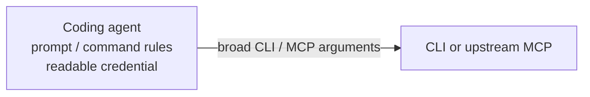
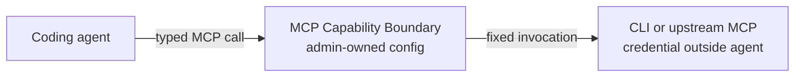

# MCP Capability Boundary User Guide

## Why this exists

There are three practical problems:

1. **Scope instructions are not boundaries.** You can tell an agent “use this namespace” or “work only in this project,” but the underlying MCP tool may still accept every namespace or project. This boundary removes or constrains those choices mechanically.
2. **CLI rules become brittle at the argument level.** A command rule may allow a CLI or subcommand, but safely describing every option, position, and combination is difficult and agent-specific. Typed inputs are mapped into a fixed argv shape instead.
3. **Direct CLI access exposes credentials.** A granular credential reduces its authority, but an agent that receives it can still disclose or reuse it. Here, the broker and target hold the credential and expose only the narrower operation.

MCP is not the only possible public interface. It is used because coding agents already understand typed MCP tools and approval settings, while enforcement remains server-side.

## Before and after

With direct access, prompts and command rules guide the agent, but the agent still holds a credential and constructs calls against the target's broad interface.



With MCP Capability Boundary, the agent receives only the configured tool interface. The administrator controls the accepted schema and fixed bindings, and the credential remains on the broker/target side of the boundary.



## The model

A configuration declares:

1. trusted CLI or upstream MCP targets;
2. the public tools an agent may see;
3. a closed input schema for each public tool;
4. how validated inputs and administrator-owned values map to CLI argv or upstream MCP arguments; and
5. time and output limits for every target.

The broker validates the entire configuration at startup. For each call it validates the public input again, resolves one fixed invocation, and only then starts or calls the target. It never constructs a shell command string.

This boundary is only meaningful when the agent cannot modify the broker, configuration, target, or MCP registration and cannot bypass the broker with the same credentials. Placement outside a workspace is not enough if the agent's OS identity can replace the file, change a parent directory, follow a writable symlink, or invoke the target directly with the broker credential.

## Install from source

The repository pins Rust 1.98.1. Install the public binary from a checkout:

```sh
cargo install --locked --offline --path crates/boundary --bin mcp-boundary
```

For development, `cargo build --locked --offline -p mcp-boundary --bin mcp-boundary` builds the binary using the vendored dependency set. The stable project verification entry point is `./verify all`.

## Define a CLI capability

Start from an authority statement, not from all options accepted by the target. For example:

> The agent may list pods, deployments, or services in one explicitly named Kubernetes namespace, using the fixed cluster identity and JSON output. It cannot select another operation, cluster, credential, context, output language, or option.

The following illustrates that authority. Replace paths and fixed values for the deployment before validating it.

```yaml
version: 1

server:
  name: cluster-read
  transport: { kind: stdio }
  limits:
    request_bytes: 1048576
    json_depth: 32

targets:
  kubectl-read:
    kind: cli
    executable: /usr/local/bin/kubectl
    cwd: /
    environment:
      inherit: [KUBECONFIG]
      set: { LC_ALL: C }
    limits:
      timeout_ms: 30000
      stdout_bytes: 1048576
      stderr_bytes: 65536

tools:
  get_kubernetes_resources:
    title: Get Kubernetes resources
    description: List an allowed resource in one explicitly supplied namespace
    annotations:
      read_only_hint: true
      destructive_hint: false
      idempotent_hint: true
      open_world_hint: true
    input_schema:
      type: object
      additionalProperties: false
      properties:
        resource:
          type: string
          enum: [pods, deployments, services]
        namespace:
          type: string
          minLength: 1
          maxLength: 63
          pattern: "^[a-z0-9]([-a-z0-9]*[a-z0-9])?$"
      required: [resource, namespace]
    invoke:
      target: kubectl-read
      cli:
        argv:
          - literal: --context
          - literal: home
          - literal: get
          - input: /resource
          - literal: --namespace
          - input: /namespace
          - literal: --output=json
    output: { kind: json }
```

`literal` creates one administrator-owned argv element. `input` takes one required scalar selected by JSON Pointer and emits one argv element. `each` may be used instead of `input` for a required array of scalar values, emitting one element per item. None of these bindings performs shell expansion, splits a string, constructs an option name, or changes the executable.

Do not expose an arbitrary subcommand, option list, path, URL, kubeconfig, context, endpoint, identity, template, query language, or shell expression merely because it remains one argv element. The target may interpret that element as a much broader operation. Use separate, narrowly named public tools when operations have different authority.

The repository includes an [authoring and review skill](../skills/author-capability-gate-config/SKILL.md) for working through target semantics, deployment placement, adversarial inputs, and residual authority.

## Validate before serving

All management commands require an absolute configuration path.

```sh
mcp-boundary check --config /absolute/path/boundary.yaml
mcp-boundary tools --config /absolute/path/boundary.yaml --format json
```

`check` parses the complete configuration, compiles schemas and bindings, and verifies static executable and working-directory paths. It does not invoke a CLI target or call an upstream MCP tool. `tools` performs the same validation and prints the normalized public `tools/list` catalog; target paths, fixed arguments, and credentials are not part of that catalog.

The management process exits with status 0 on success, 2 for command-line usage errors, 3 for configuration errors, and 4 for a broker runtime failure. A target-specific tool error is returned over MCP and does not terminate a healthy server.

## Register the server

Configure the MCP client or coding agent to launch the following executable and argument vector over STDIO:

```text
command: /absolute/path/to/mcp-boundary
arguments: [serve, --config, /absolute/path/boundary.yaml]
```

Use separate command and argument fields; do not wrap the invocation in `sh -c`. Standard output is reserved for MCP JSON-RPC. Startup diagnostics and optional operator events use standard error.

The MCP registration is part of the security boundary. An agent-writable project setting is not sufficient if the agent can change the server command, configuration path, or environment. Use the coding agent's effective managed policy or another administrator-controlled registration mechanism, and verify the behavior of both the agent process and its children.

## Keep credentials outside the agent

The target environment starts empty. Only names listed in `environment.inherit` and fixed entries in `environment.set` are passed to a CLI or upstream MCP process. `HOME`, `PATH`, locale, and credentials are not inherited implicitly. A named inherited variable must exist when the broker adopts the configuration.

Environment filtering alone does not hide credentials from the coding agent. A useful deployment must establish all of the following:

- the agent cannot read or alter the credential source;
- the agent cannot alter the broker, configuration, target executable, or MCP registration;
- the agent cannot invoke the target or upstream service directly with the broker identity; and
- the broker can still read the configuration and credential and reach the target.

On a managed macOS host, administrator-owned candidates include `/usr/local/libexec/mcp-boundary/mcp-boundary` and `/Library/Application Support/mcp-boundary/<instance>/config.yaml`. On Linux, common candidates are `/usr/local/libexec/mcp-boundary/mcp-boundary` and `/etc/mcp-boundary/<instance>.yaml`. These paths are not safe by themselves; ownership, parent directories, symlink targets, sandbox rules, and direct target access must all be checked.

If the coding agent and broker share an unrestricted OS identity, a read-only config does not create a credential boundary. Run the broker under a separate service identity, container, VM, or host and expose only its MCP interface. If the MCP client and the current STDIO transport cannot preserve that separation, the deployment is blocked rather than partially protected.

## Proxy an upstream MCP tool

An upstream MCP target is also declared explicitly. The broker publishes only configured tools; it does not mirror the upstream catalog.

```yaml
targets:
  source-control:
    kind: mcp
    transport:
      kind: stdio
      command: /usr/local/bin/source-control-mcp
      args: [serve]
      cwd: /
      environment:
        inherit: [SOURCE_CONTROL_TOKEN]
        set: { LC_ALL: C }
    limits:
      timeout_ms: 30000
      output_bytes: 1048576
      stderr_bytes: 65536

tools:
  list_private_repositories:
    description: List repositories for the configured organization
    input_schema:
      type: object
      additionalProperties: false
      properties:
        limit:
          type: integer
          minimum: 1
          maximum: 100
      required: [limit]
    invoke:
      target: source-control
      mcp:
        tool: list_repositories
        arguments:
          organization: { literal: example-org }
          visibility: { literal: private }
          limit: { input: /limit }
    output: { kind: structured }
```

MCP argument bindings support `literal`, `input`, allowlisted `environment`, nested `object`, and `array` values. The upstream command, tool name, and fixed arguments are not caller-selectable. The upstream server remains trusted code with the full authority of its credential.

## Schema and binding constraints

The configuration is YAML 1.2; compatible JSON is also accepted. Unknown fields, duplicate keys, custom tags, aliases, and merge keys are rejected.

The supported JSON Schema subset includes:

- types: `object`, `array`, `string`, `integer`, `number`, `boolean`, and `null`;
- `properties`, `required`, and `additionalProperties: false`;
- `items`, `minItems`, `maxItems`, and `uniqueItems`;
- `enum`, `minimum`, `maximum`, `minLength`, `maxLength`, and `pattern`.

Every public schema has an object root. Every declared object property is required, and every object is closed. Optional properties, `default`, `format`, `const`, `$ref`, `$defs`, unions, negation, and conditional schemas are not supported. Split meaningfully different shapes into separate public tools.

Patterns use a linear-time regular-expression engine. They follow JSON Schema's partial-match behavior, so use anchors when the entire string must match.

## Results and diagnostics

CLI tools may declare `output.kind: text` or `output.kind: json`. Text preserves valid UTF-8 stdout as one text content block. JSON requires stdout to be exactly one JSON value and returns structured content plus deterministic compact JSON text. Upstream MCP tools may use `text` or `structured`, subject to the configured result shape.

Normal diagnostics do not include executable paths, argv, environment values, public input, upstream arguments, or raw target output. To emit one JSON Lines completion event per tool call on standard error, start the broker with:

```sh
MCP_BOUNDARY_LOG=debug mcp-boundary serve --config /absolute/path/boundary.yaml
```

Debug events can contain target stderr and exit status. Treat debug stderr as temporary operator-sensitive output; do not forward it to the MCP client or a general-purpose log sink. See [Observability](observability-design.md) for the event contract.

## Current constraints

- The public transport is STDIO. Upstream MCP targets also use STDIO; HTTP transports are not implemented.
- The public server exposes tools only. MCP prompts, resources, sampling, and elicitation are not provided.
- A broker process has no authenticated per-agent identity. All callers sharing it are one trust domain.
- Configuration is adopted atomically at startup. Runtime reload is not provided.
- Executable, upstream command, and working-directory paths are absolute. Shell aliases and `PATH` lookup are not used.
- CLI targets run without a shell and with closed standard input. This prevents shell parsing but does not make a target's own option, expression, plugin, or scripting language safe.
- The broker validates declared types, values, bindings, and resource limits. It does not infer whether an operation is read-only or semantically authorized.
- Tool annotations describe a capability to the client; they do not enforce it.
- Targets and upstream MCP implementations are trusted. The broker does not sandbox or monitor their internal behavior.
- Target output is not filtered field by field. A permitted target can still return sensitive data.
- The configuration and fixed environment may contain sensitive values. Protect their confidentiality as well as their integrity.
- Public calls are limited to 16 concurrent calls per broker. Each upstream MCP target accepts one active call and rejects another as busy rather than queueing it.
- Request, configuration, schema, string, array, output, timeout, and diagnostic sizes have finite implementation limits. See the normative [system design](design.md) when selecting boundary values.
- Modern MCP discovery is attempted first with a legacy initialization fallback. Protocol negotiation does not expand the configured tool surface.

These constraints are intentional for the current capability boundary. Do not work around them with a shell wrapper or a broadly parameterized helper; doing so moves the unrestricted interface behind a trusted executable and defeats the configuration boundary.
